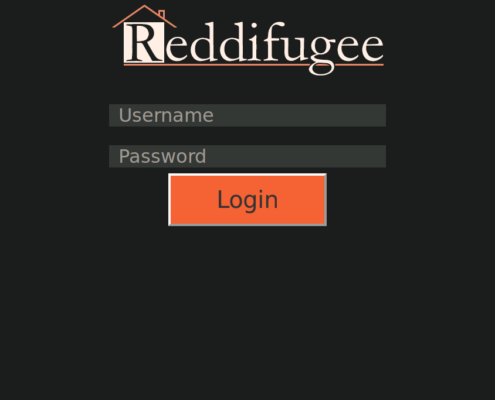
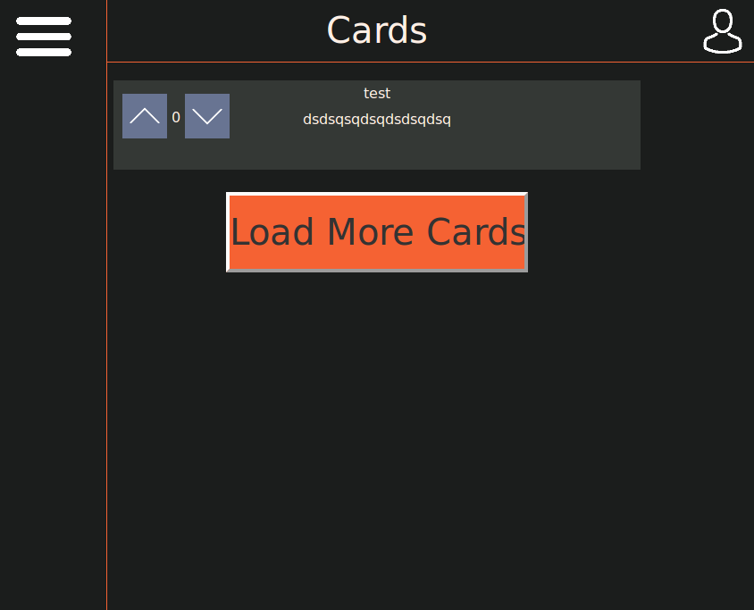
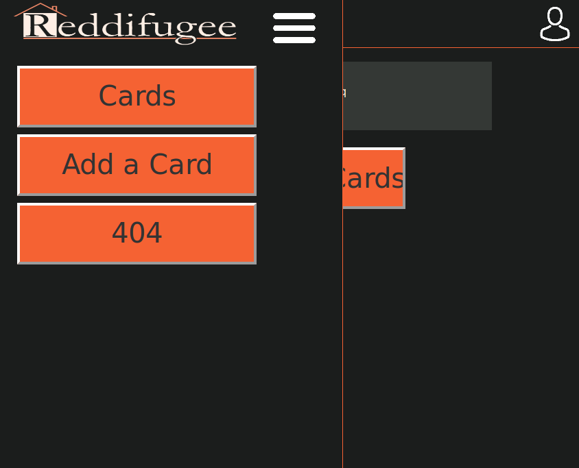

# Nuit Info 2016

Ce repo contient le code produit par l'équipe "char ibout;" à l'occasion de la Nuit de l'info édition 2016

## Challenges 

- [x] [404: perdu dans un décor innatendu](http://www.nuitdelinfo.com/n2i/defis/100)
- [x] [GJN: Gamifier son projet de la nuit de l'info](http://www.nuitdelinfo.com/n2i/defis/120)
- [x] [Mascotte/Logo](http://www.nuitdelinfo.com/n2i/defis/83)
- [ ] [Le jour où le mobile dépassa le desktop](http://www.nuitdelinfo.com/n2i/defis/99)
- [x] [It's in the game](http://www.nuitdelinfo.com/n2i/defis/105)

## Conclusion 

Malgré des heures de combat acharné, le temps fut, encore une fois, notre fatal opposant.  
Ayant combattu contre des scripts php récalcitrants et des problèmes d'en-tête CORS, l'équipe char ibout; dûe finalement s'incliner. 

## Résultat 

